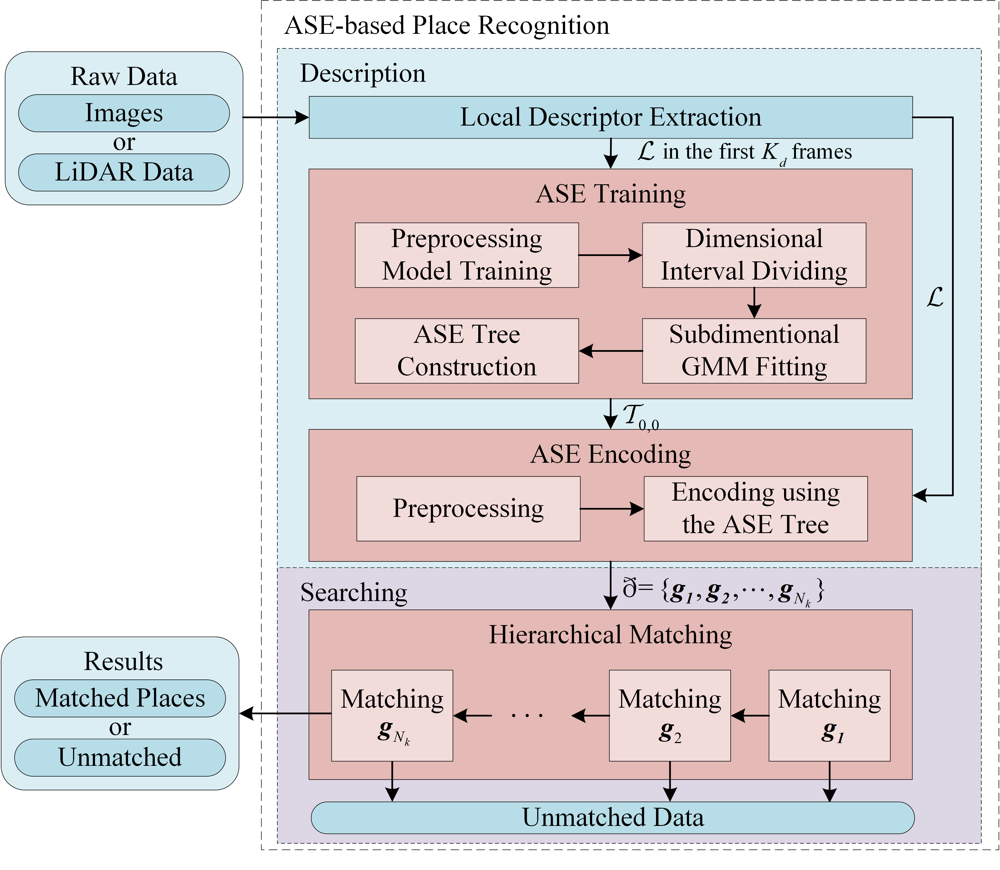
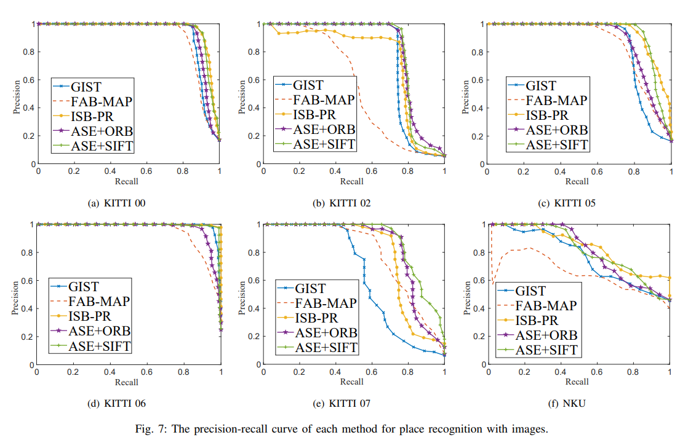
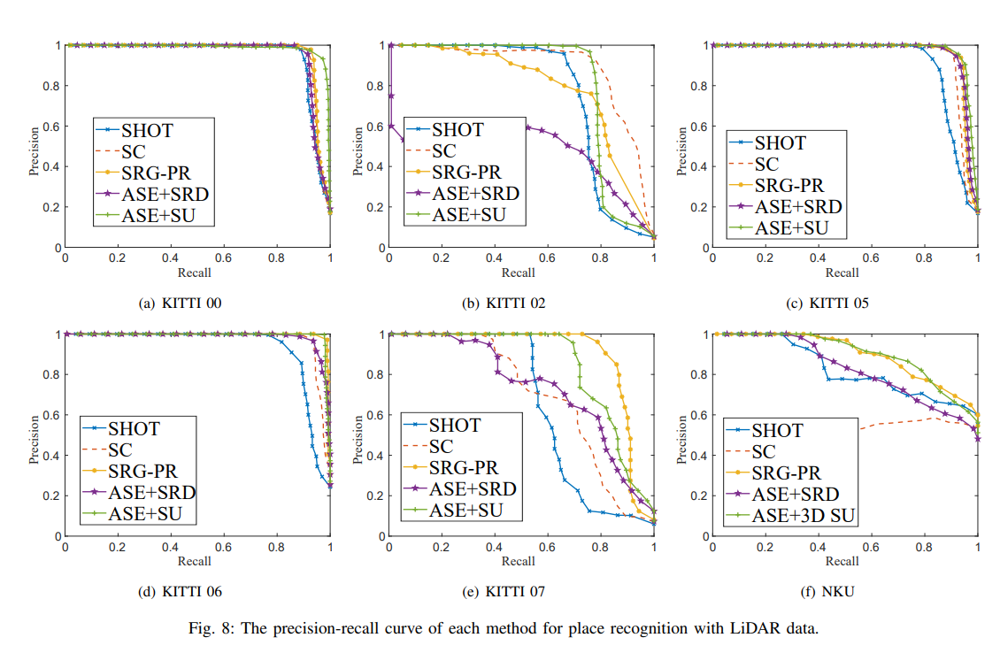
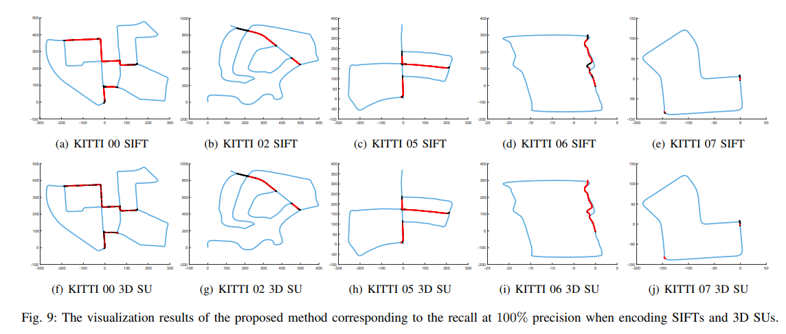
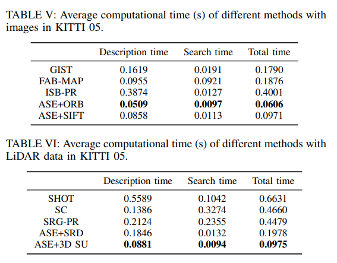

# ASE-Encoder

## Introdution

+ This work is an implement for the paper "**Adaptive Soft-Encoding: A General Unsupervised Encoding Method for Place Recognition**", which is published in: `IEEE Transactions on Instrumentation and Measurement` (Volume: 72).

+ Doi: https://doi.org/10.1109/TIM.2023.3307752

## Abstract

- Place recognition (PR) is an important problem in environment perception, which can help simultaneous localization and mapping (SLAM), as well as scene understanding of mobile robots. For PR, feature aggregation plays an important role in the representation of environments. In this article, an adaptive soft encoding (ASE) method is proposed for aggregating numerous features into low-dimensional feature vectors, which includes a training phase and an encoding phase. For the training phase, the information along each dimension of the features is evaluated, which is further employed to assign all dimensions into different subdimensional intervals. After that, subdimensional Gaussian mixture models (SD-GMMs) are fit by features in the subdimensional intervals and organized into an ASE tree, of which the tree nodes hierarchically store the parameters of the SD-GMMs to reflect the distribution of the features. For the encoding phase, features are fed into the root node of the ASE tree. The weight of each node is calculated from top to bottom to generate multiple aggregated feature vectors with different description capabilities. In addition, an ASE-based framework for PR is proposed, in which local descriptors are extracted from sensor data (e.g., images or LiDAR data), and then aggregated into global descriptors by ASE. Finally, owing to the hierarchical structure of the ASE tree, a hierarchical matching strategy of the global descriptors is designed to recognize places efficiently. Experimental results demonstrate that feature vectors aggregated by ASE have strong distinguishability, and the ASE-based PR method achieves good accuracy and efficiency. The code of ASE can be accessed at https://github.com/wdyiwdwd/ASE-Encoder.

    

## How to run the demo

+ sudo apt-get install gcc g++ build-essential cmake 
+ sudo apt-get install autotools-dev libicu-dev libbz2-dev libboost-all-dev
+ sudo apt-get install libeigen3-dev
+ sudo apt-get install git
+ sudo ap-get update
+ git clone git@github.com:wdyiwdwd/ASE-Encoder.git
+ cd ASE-Encoder
+ mkdir bin & mkdir build
+ cd build
+ cmake ..
+ make
+ ../bin/Test

In this demo, the ASE encodes the input data into a feature vector, which is a low-dimentianal representation of the input data and extracts the distribution characteristic of them.

## The self-built dataset NKU

+ In this work, a new corridor dataset for place recognition using images or LiDAR data is collected in Nankai University and published online. 311 synchronous frames of images and LiDAR data are collected by a monocular camera and a Velodyne HDL-32 LiDAR installed on a Pioneer3 DX mobile robot moving in an indoor corridor. Each image has 1920 * 1080 pixels and each of LiDAR data has 60000 scan points approximately, of which the maximal range is about 40.0 m.
+ The dataset can be accessed at https://drive.google.com/file/d/1nzscGa1VHEMyFdDGOFSkaeK_FW5U2w4t/view?usp=sharing

+ Visualization

    

## Results

- Precision-recall evaluation

    

    

- Visualization results

    

- Runtime

    

 

[1] *H. Gao, X. Zhang, J. Yuan, J. Song, and Y. Fang, “A novel global localization approach based on structural unit encoding and multiple hypothesis tracking,” IEEE Transactions on Instrumentation and Measurement, vol. 68, no. 11, pp. 4427–4442, 2019.*

[2] *G. Zhou, J. Yuan, H. Gao, Q. Sun, X. Zhang, and S. Yu, “The 3d lidar point cloud descriptor based on structural unit soft-encoding in structured environment,” Robot, vol. 42, pp. 641–650, 11 2020.*

 
 
 

By Gong

